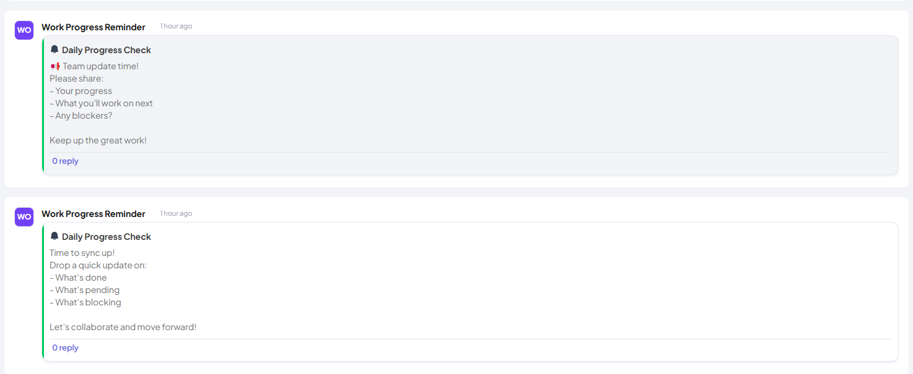
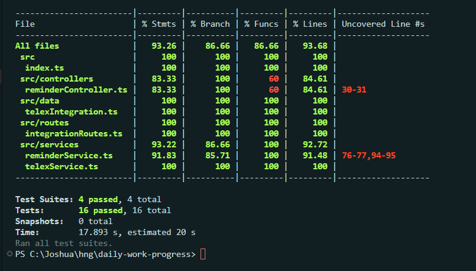
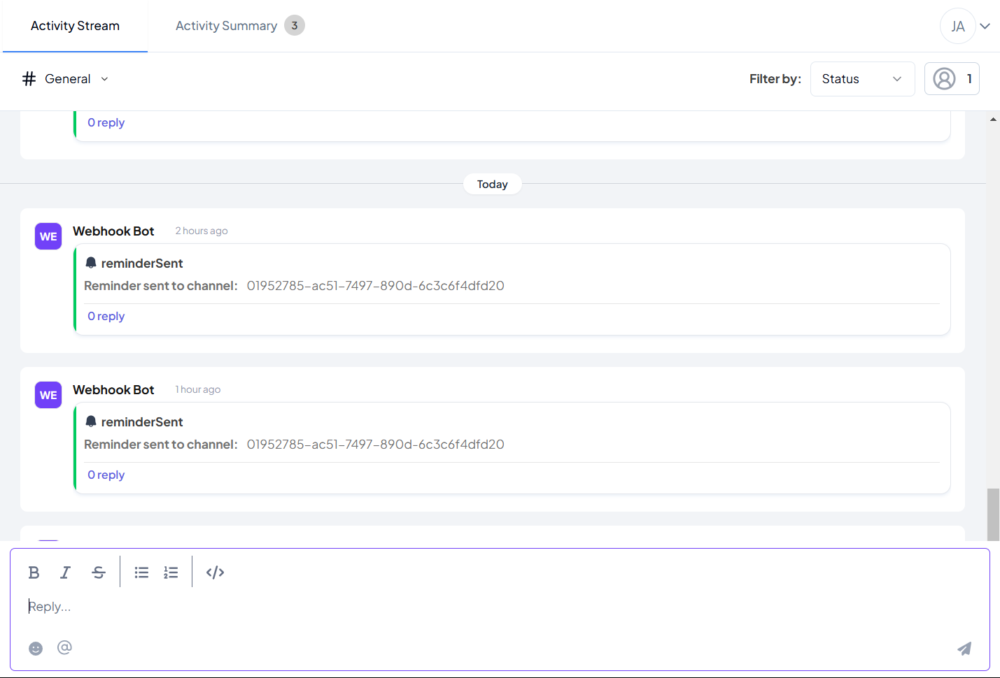

# Daily Work Progress Reminder - Telex Integration

A Telex integration that sends scheduled reminders to team members to submit their work progress updates and ensure code pushes.

## 🚀 Features

- Scheduled work progress reminders
- Customizable reminder messages
- Configurable reminder intervals
- Random or custom message templates 
- Handles work day configurations
- Webhook notifications
- Channel message delivery
  
## 📸 Screenshots

### Channel Message

### Test Results    

### Webhook Notification



## 📋 Prerequisites

- Node.js (v20 or higher)
- npm or yarn
- A Telex account
- Environment variables setup


## 🔗 Important Links
- Repository: `[https://github.com/jayflashy/daily-work-progress]`
- JSON Config: `[https://daily-work-progress.onrender.com/integration.json]`
- Deployment: `[https://daily-work-progress.onrender.com]`

## 🛠️ Installation

1. Clone the repository:

```bash
git clone https://github.com/jayflashy/daily-work-progress.git
cd daily-work-progress
```

2. Install dependencies:
```bash
npm install
```

3. Create a `.env` file:
```env
PORT=3000
APP_URL=https://daily-work-progress.onrender.com
TELEX_CHANNEL_ID="your-telex-channel-id"
TELEX_BASE_URL="https://ping.telex.im/v1"
```

4. Build the project:
```bash
npm run build
```

5. Start the server:
```bash
npm start
```

## 🔧 Configuration

### Environment Variables

- `PORT`: Server port (default: 3000)
- `APP_URL`: Your application's base URL
- `TELEX_CHANNEL_ID`: Your Telex channel ID
- `TELEX_BASE_URL`: Telex base URL

### Integration Settings

The integration can be configured with the following settings:

- `interval`: Crontab format for reminder schedule (e.g., "0 17 * * 1-5" for 5 PM weekdays)
- `reminder_message`: Custom message template

## 📝 API Endpoints

### GET /integration.json
Returns the integration schema and configuration options.

### POST /tick
Receives scheduled triggers from Telex and sends reminders.

#### Request Payload
```json
{
    "channel_id": "string",
    "return_url": "string",
    "settings": [
        {
            "label": "string",
            "type": "string",
            "required": boolean,
            "default": "string"
        }
    ]
}
```

## 🧪 Testing

### Running Tests
```bash
# Run all tests
npm test

# Run tests in watch mode
npm run test:watch

# Generate test coverage report
npm run test:coverage
```

### Test Structure
- `__tests__/reminderService.test.ts`: Tests for reminder functionality
  - Random message generation
  - Custom message handling
  - Work day validation
  - Webhook notifications
  - Channel message delivery

### Test Coverage
- Service layer tests
- Message generation
- Integration with Telex
- Webhook notifications
- Error handling

### Writing Tests
Example test case:
```typescript
it("should send custom message when provided", async () => {
  const customPayload = {
    channel_id: "test-channel-id",
    settings: [
      {
        label: "message style",
        default: "custom",
        type: "dropdown"
      },
      {
        label: "reminder message",
        default: "Custom message"
      }
    ]
  };

  await sendReminder(customPayload);
  expect(toChannel).toHaveBeenCalledWith(
    "test-channel-id", 
    expect.objectContaining({
      message: "Custom message"
    })
  );
});
```

## 📦 Deployment

1. Build the project:
```bash
npm run build
```

2. Set up your production environment variables
3. Deploy the built files to your hosting service

## 🔍 Monitoring

Monitor your integration using:
- Server logs
- Telex dashboard
- Response status codes
- Error tracking

## 🛟 Troubleshooting

Common issues and solutions:

1. **Reminder not sending**
   - Check if the interval setting is correct
   - Verify the tick_url is accessible
   - Check server logs for errors

2. **Wrong message format**
   - Verify the message template
   - Check if all required fields are present

## 📚 Development

### Project Structure
```
src/
├── app.ts              # Application entry point
├── routes/            # Route definitions
├── controllers/       # Request handlers
├── services/         # Business logic
└── models/           # Type definitions
```

### Adding New Features

1. Update the schema in `src/data/telexIntegration.ts`
2. Add new message templates in `src/data/messageTemplates.json`
3. Update types in `src/types/index.ts`
4. Test the changes

## 🤝 Contributing

1. Fork the repository
2. Create a feature branch
3. Commit your changes
4. Push to the branch
5. Create a Pull Request

## 📄 License

This project is licensed under the MIT License - see the LICENSE file for details.

## 👥 Authors

- Your Name - Initial work

## 🙏 Acknowledgments

- Telex team for the integration platform
- Contributors and testers
